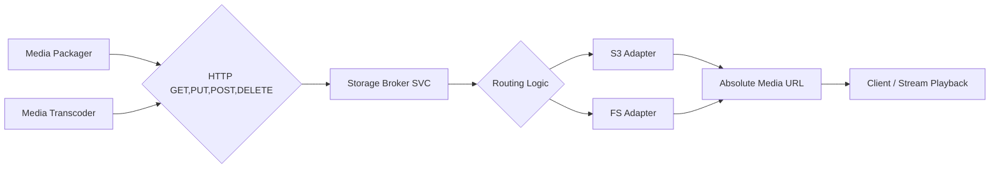

# Storage Broker Service

The Storage Broker service acts as an intermediary, receiving media files from other components within the platform and routing them to designated storage locations. It also generates absolute media URLs for streams and files to ensure accessibility.

**Key Responsibilities:**

* **Receive Media:** Accepts media files from:
    * **Packager Service:** Outputs HLS and DASH segments.
    * **Transcoder Service:** Provides processed and converted media files.
* **Route to Storage:** Determines the appropriate storage destination based on defined rules and internal configurations.
* **Support Storage Backends:** Integrates with various storage backends, such as:
    * **Storage (FS):** File System storage.
    * **Storage (S3):** Amazon S3 compatible storage (e.g., AWS S3, Google Cloud Storage, Azure Blob Storage).
* **Ensure Data Integrity:** Implements mechanisms to verify data integrity during transfer and storage.

## Process Flow

1. **Media Reception:**
    * The Storage Broker receives media files from the Packager and Transcoder via HTTP PUT OR POST.

2. **Routing Decision:**
    * The Storage Broker analyzes the incoming files (metadata, file type, etc.) and applies routing rules to determine the target storage backend.
    * Rules may consider factors such as file type, content type, size, and storage quotas.

3. **Storage Interaction:**
    * **File System (FS):** If routed to the File System, the Storage Broker interacts with the FS Adapter to write the file to the designated storage location.
    * **S3 Compatible Storage:** If routed to an S3-compatible service, the Storage Broker interacts with the corresponding S3 Adapter (e.g., AWS SDK, Google Cloud Storage client) to upload the file to the designated bucket.

4. **Data Integrity Checks:**
    * Depending on the storage backend and configuration, the Storage Broker may perform checksum verifications or other data integrity checks during and after the transfer.

## Diagram



---

Here's your updated Markdown with both the raw JSON storage configuration and its Base64-encoded versions:

```md
## Example: Media Upload Using Packager

Here’s an example of defining an upload URL and using it with a media packager to stream HLS segments to the **Storage Broker**.

### Storage Configuration

Before sending the storage configuration, it must be encoded into a Base64 string and included in the `User-Agent` or `Authorization` header.

#### Sample Storage Config (Raw JSON)

```json
{
  "driver": "fs, s3, or gcs",
  "fs": {
    "dataPath": "./tmp"
  },
  "s3": {
    "endpoint": "",
    "accessKeyId": "",
    "secretAccessKey": "",
    "region": "",
    "bucket": "",
    "enableSSL": false,
    "usePathStyle": false
  },
  "gcs": {
    "credentialsFile": "",
    "bucket": ""
  }
}
```

#### Base64 Encoded Storage Config

The above JSON is Base64-encoded before being sent.

```bash
# Base64-encoded File System storage config
FS_STORAGE_BASE64="JWT access token"

# Base64-encoded S3 storage config
S3_STORAGE_BASE64="JWT access token"
```

### Upload and Packaging Process

```bash
# Define upload URL
export UPLOAD_URL="http://localhost:9500/tv1"

# Start packaging and streaming with Storage Config sent via User-Agent or HTTP Header

packager \
    "input=video.mp4,stream=audio,segment_template=${UPLOAD_URL}/audio-\$Number\$.aac,playlist_name=audio.m3u8" \
    "input=video.mp4,stream=video,segment_template=${UPLOAD_URL}/video-\$Number\$.ts,playlist_name=video.m3u8" \
    --hls_master_playlist_output "${UPLOAD_URL}/master.m3u8" \
    --hls_playlist_type LIVE \
    --user_agent "${FS_STORAGE_BASE64}" \
    # --header "Authorization: Bearer ${FS_STORAGE_BASE64}" \
    --vmodule=http_file=1
```

### Explanation of the Example:

1. **Raw JSON Storage Config:**
   - Shows the actual storage configuration before encoding.

2. **Base64 Encoding:**
   - The JSON storage config is converted into Base64 format before being sent.

3. **Transmission Methods:**
   - The encoded config is sent via either:
     - The `User-Agent` field.
     - The `Authorization` HTTP header.

4. **`UPLOAD_URL`:**
   - Specifies the endpoint of the Storage Broker service where HLS segments will be uploaded.

5. **Protocol:**
   - Media segments and playlists are sent to the Storage Broker using HTTP PUT.

---
