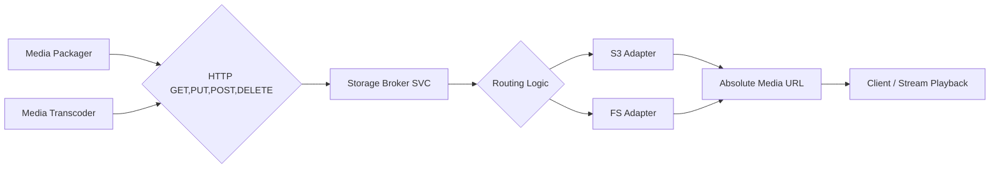

# Storage

The Storage service acts as an intermediary, receiving media files from other components within the platform and routing them to designated storage locations. It also generates absolute media URLs for streams and files to ensure accessibility.

**Key Responsibilities:**

* **Receive Media:** Accepts media files from:
    * **Packager Service:** Outputs HLS and DASH segments.
    * **Transcoder Service:** Provides processed and converted media files.
* **Route to Storage:** Determines the appropriate storage destination based on defined rules and internal configurations.
* **Support Storage Backends:** Integrates with various storage backends, such as:
    * **Storage (FS):** File System storage.
    * **Storage via rclone:** Uses [rclone](https://rclone.org/overview/) for storage proxying, supporting multiple cloud storage providers.
        * Configurable via environment variables:
          ```sh
          STORAGE_ADDR=:9500
          STORAGE_DRIVER=s3
          STORAGE_OUTPUT_LOCATION=bucket-name or root directory
          RCLONE_S3_PROVIDER="Minio"
          RCLONE_S3_ACCESS_KEY_ID="Q3AM3UQ867SPQQA43P2F"
          RCLONE_S3_SECRET_ACCESS_KEY="zuf+tfteSlswRu7BJ86wekitnifILbZam1KYY3TG"
          RCLONE_S3_ENDPOINT="play.min.io"
          RCLONE_S3_ACL="public-read"
          ```
## Process Flow

1. **Media Reception:**
    * The Storage Broker receives media files from the Packager and Transcoder via HTTP PUT OR POST.

2. **Routing Decision:**
    * The Storage Broker analyzes the incoming files (metadata, file type, etc.) and applies routing rules to determine the target storage backend.
    * Rules may consider factors such as file type, content type, size, and storage quotas.

3. **Storage Interaction:**
    * **File System (FS):** If routed to the File System, the Storage Broker interacts with the FS Adapter to write the file to the designated storage location.
    * **S3 Compatible Storage:** If routed to an S3-compatible service, the Storage Broker interacts with the corresponding S3 Adapter (e.g., AWS SDK, Google Cloud Storage client) to upload the file to the designated bucket.

4. **Data Integrity Checks:**
    * Depending on the storage backend and configuration, the Storage Broker may perform checksum verifications or other data integrity checks during and after the transfer.

## Diagram



---

Here's your updated Markdown with both the raw JSON storage configuration and its Base64-encoded versions:

```md
## Example: Media Upload Using Packager

Here’s an example of defining an upload URL and using it with a media packager to stream HLS segments to the **Storage Broker**.

### Upload and Packaging Process

```bash
# Define upload URL
export UPLOAD_URL="http://localhost:9500/tv1"

# Start packaging and streaming with Storage Config sent via User-Agent or HTTP Header

packager \
    "input=video.mp4,stream=audio,segment_template=${UPLOAD_URL}/audio-\$Number\$.aac,playlist_name=audio.m3u8" \
    "input=video.mp4,stream=video,segment_template=${UPLOAD_URL}/video-\$Number\$.ts,playlist_name=video.m3u8" \
    --hls_master_playlist_output "${UPLOAD_URL}/master.m3u8" \
    --hls_playlist_type LIVE \
    --vmodule=http_file=1
```

## Docker Build Instructions

To build the Storage Service Docker image, run the following command:

```sh
docker buildx build --platform linux/arm64,linux/amd64 -t storage:latest \
  --build-arg GO_VERSION=1.23.5 \
  .
```

This command builds the `storage` image using the specified versions of dependencies and tools.

